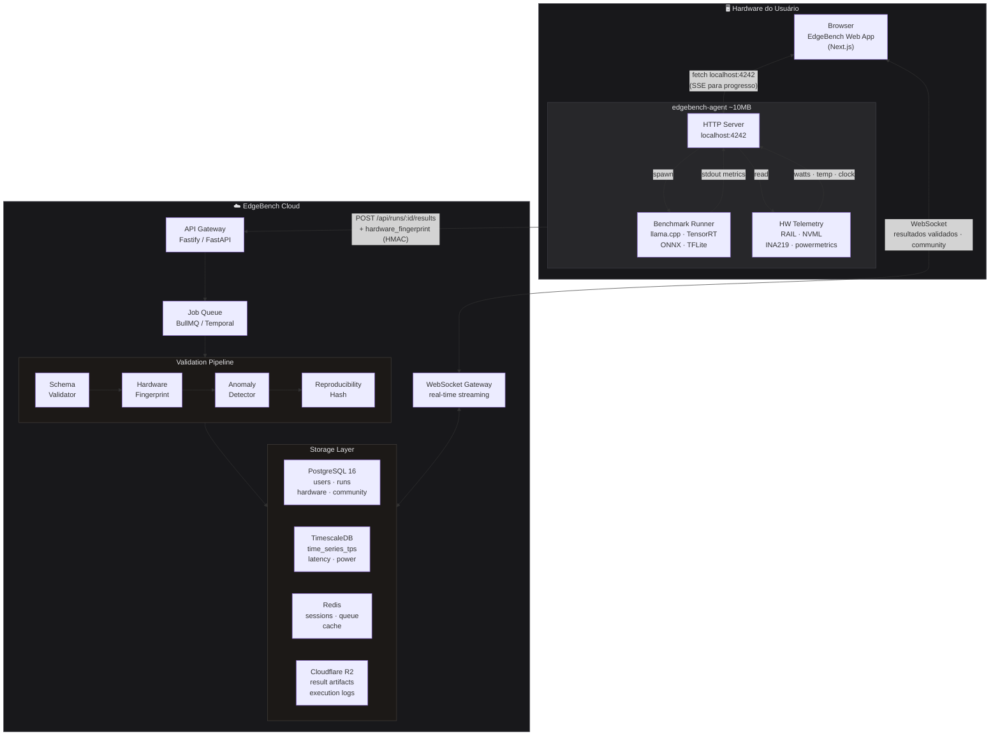
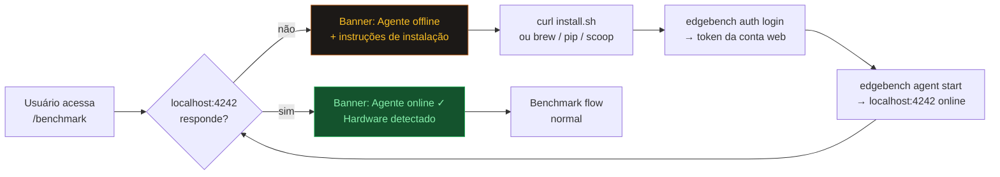
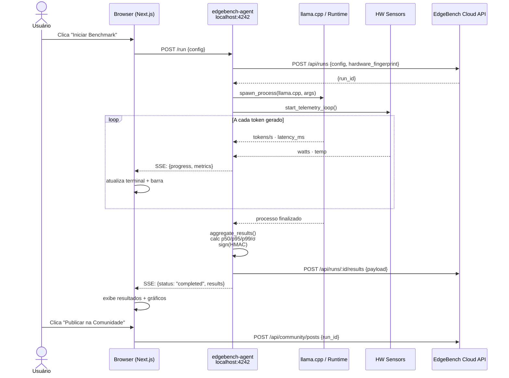
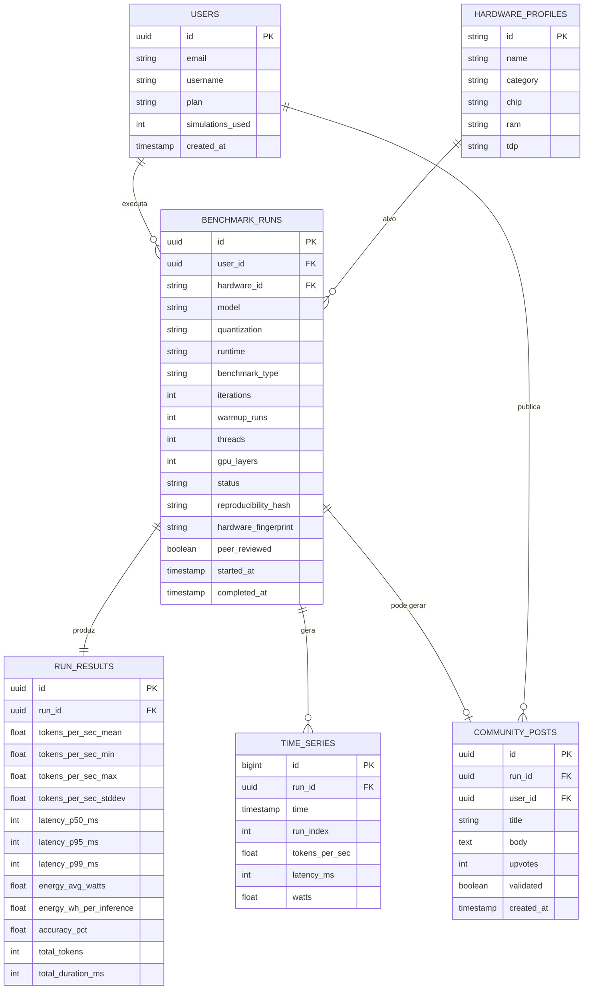
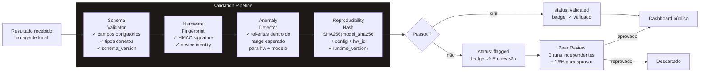
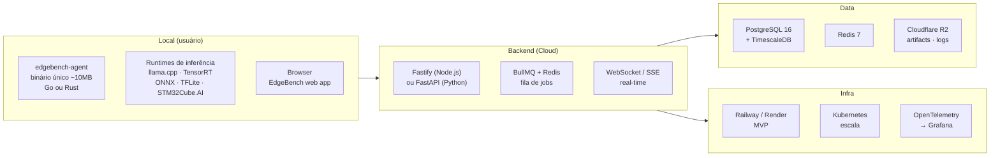

# EdgeBench — Arquitetura do Sistema

## Visão Geral

O EdgeBench segue o padrão **Local Agent**: um binário leve instalado uma vez pelo usuário
que permite ao front web (rodando no browser) disparar benchmarks reais no hardware local.
Não é necessário instalar um desktop app — o front é uma web app normal.



---

## Instalação e Onboarding do Agente



---

## Fluxo de Execução



---

## Modelo de Dados



---

## Pipeline de Validação (Anti-Fraude)



---

## Stack Completa



---

## Contrato da API do Agente Local

O agente expõe um servidor HTTP em `localhost:4242` consumido exclusivamente pelo browser.

| Método | Rota | Descrição |
|--------|------|-----------|
| `GET` | `/health` | Status do agente + hardware detectado |
| `POST` | `/run` | Inicia benchmark (retorna SSE stream) |
| `DELETE` | `/run/:id` | Cancela run em andamento |
| `GET` | `/runs` | Lista runs locais (cache do agente) |

### GET /health — resposta esperada
```json
{
  "status": "online",
  "version": "0.1.0",
  "hardware": {
    "id": "jetson-orin-nano",
    "name": "Jetson Orin Nano",
    "chip": "Ampere 1024-core",
    "ram": "8 GB",
    "tdp": "10W"
  },
  "runtimes_available": ["llama.cpp", "onnxruntime"]
}
```

### SSE stream de progresso (POST /run)
```
data: {"type":"log","line":"[FASE 1/3] Verificando ambiente... ✓"}
data: {"type":"log","line":"  Run 1/10 → 38 tok/s | 26ms"}
data: {"type":"metrics","tokens_per_sec":38,"latency_ms":26,"watts":9.1}
data: {"type":"completed","results":{...}}
```
