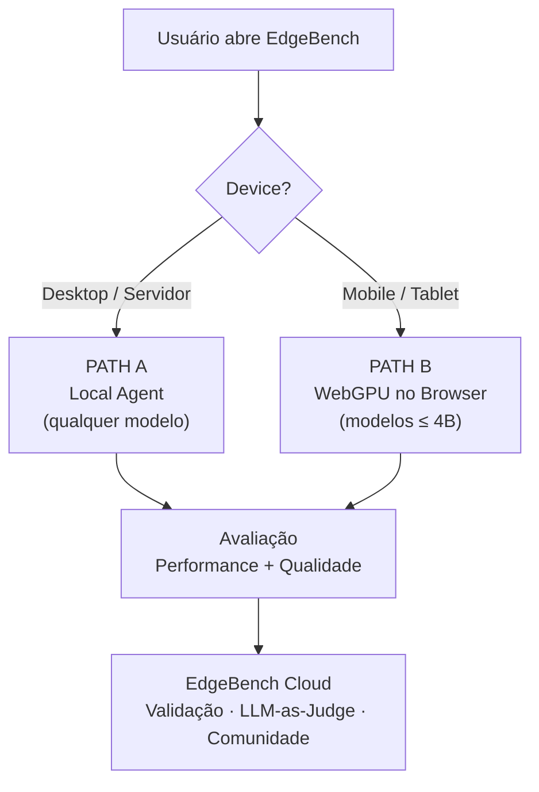
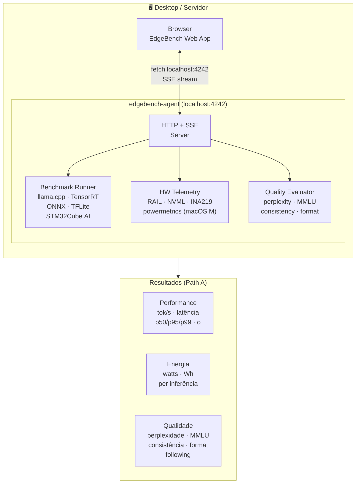
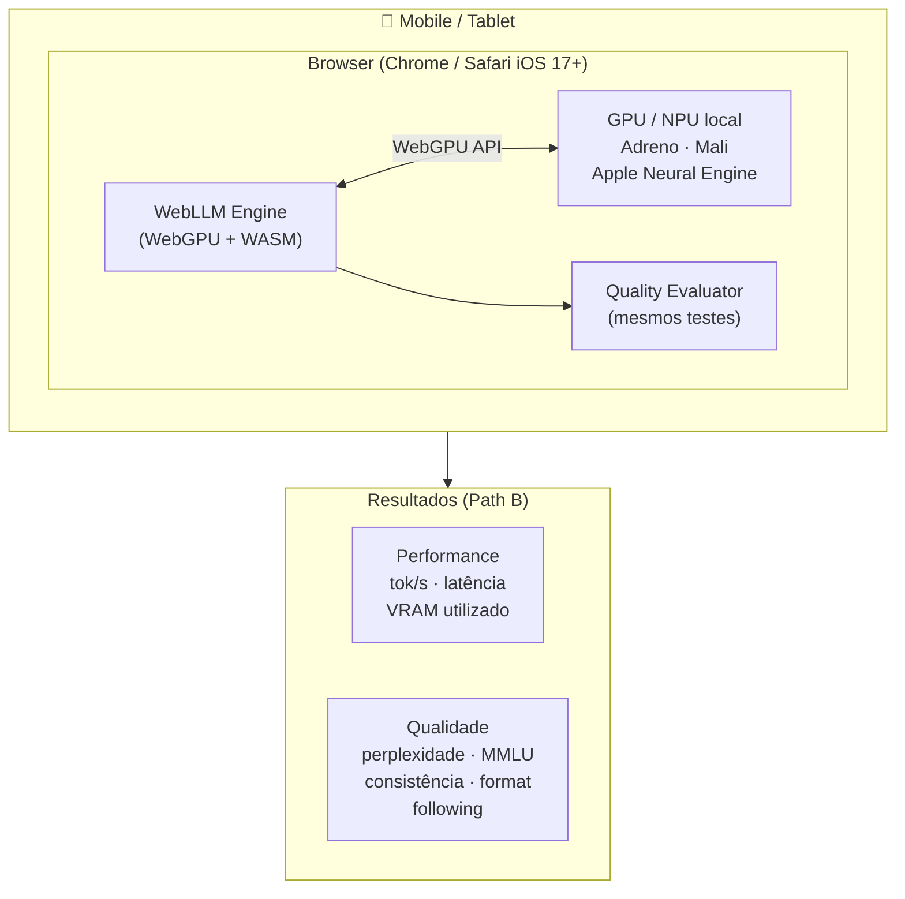
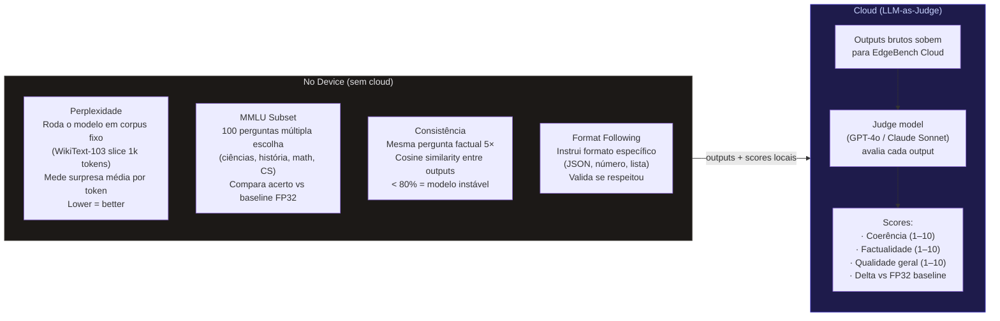
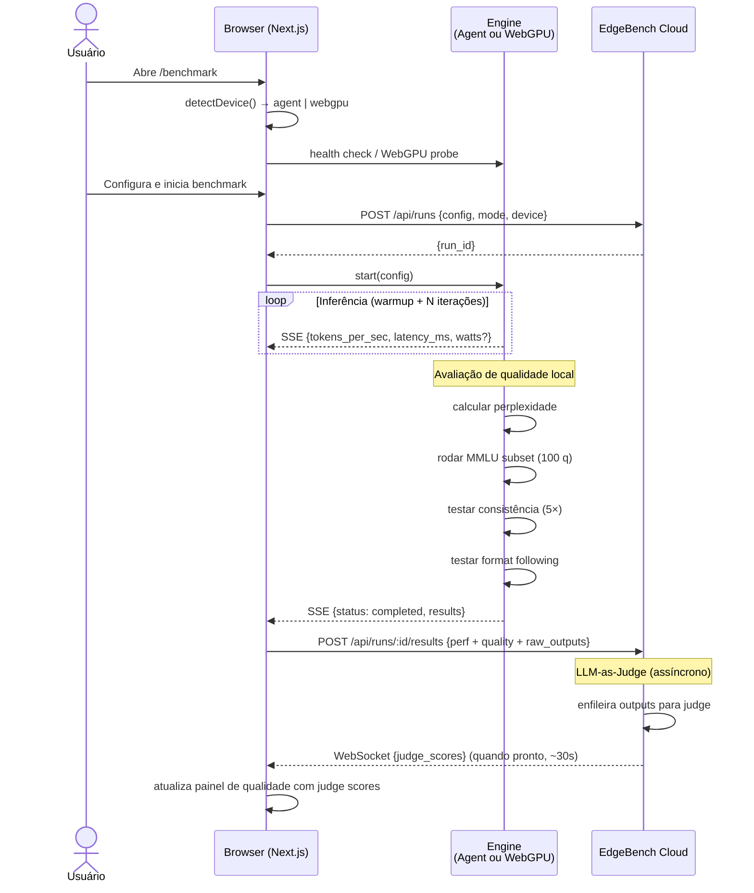
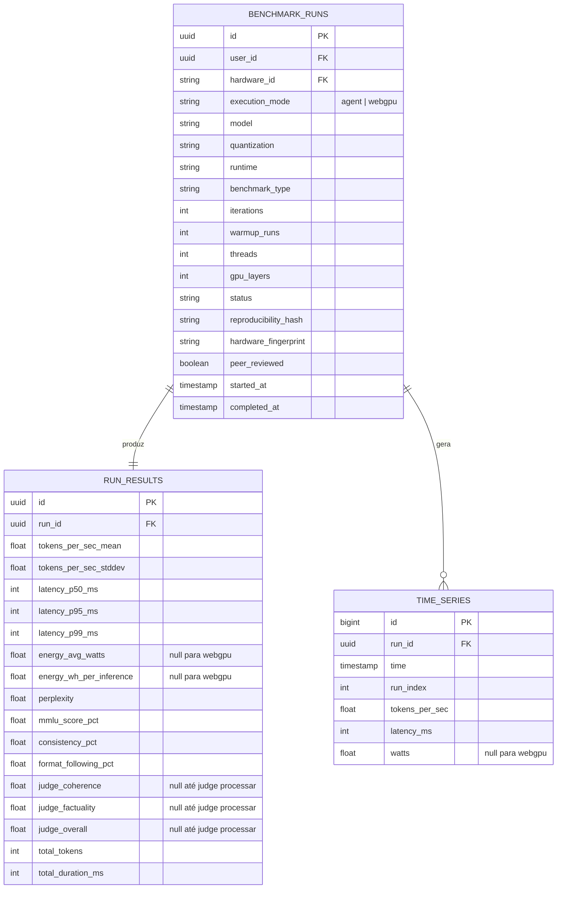

# EdgeBench — Arquitetura do Sistema

## Duas paths de execução

O EdgeBench suporta dois modos de execução que convivem na mesma plataforma.
A escolha é automática baseada no device do usuário.

---

## Path A — Desktop / Servidor (Local Agent)

Para engenheiros rodando modelos em hardware dedicado: Jetson, workstations, servidores.
Não há limitação de tamanho de modelo. Requer instalação do `edgebench-agent` (~10 MB).

### Modelos suportados (Path A)
Sem restrição — qualquer modelo que o hardware local suportar.

| Categoria | Exemplos |
|-----------|----------|
| SLM (< 4B) | TinyLlama-1.1B, Gemma-2B, Phi-3 Mini |
| LLM (4B–13B) | Llama-3-8B, Mistral-7B |
| LLM grande (> 13B) | Llama-3-70B, Mixtral-8x7B |
| Visão | YOLOv8n, MobileNetV3 |
| Áudio | Whisper-Small, Whisper-Large |

---

## Path B — Mobile / Tablet (WebGPU no Browser)

Para qualquer pessoa com um smartphone moderno. Zero instalação — o modelo roda
dentro do browser usando a GPU/NPU do device via WebGPU + WebAssembly (WebLLM / MLC LLM).

### Modelos compatíveis com WebGPU (Path B)
Limitado a modelos pequenos que cabem na VRAM disponível no browser (~2–4 GB).

| Modelo | Tamanho | Quantização | VRAM est. |
|--------|---------|-------------|-----------|
| SmolLM-360M | 360 MB | INT4 | ~0.3 GB |
| TinyLlama-1.1B | 1.1 B | INT4 | ~0.7 GB |
| Gemma-1.1B | 1.1 B | INT4 | ~0.8 GB |
| Gemma-2B | 2 B | INT4 | ~1.5 GB |
| Phi-3 Mini | 3.8 B | INT4 | ~2.4 GB |

> Nota: Path B **não mede consumo de energia** (browsers não têm acesso a sensores de hardware).
> Path A mede energia completo via RAPL / NVML / INA219.

---

## Camada de Qualidade (ambas as paths)

Além das métricas de hardware (tokens/s, watts, latência), o EdgeBench avalia
a **qualidade do output** do modelo — o quanto a quantização degradou a capacidade real.

### Referências da literatura moderna
| Métrica | Paper / Projeto | Ano |
|---------|----------------|-----|
| Perplexidade | Padrão desde GPT-2 (Radford et al.) | 2019 |
| MMLU | Massive Multitask Language Understanding (Hendrycks et al.) | 2021 |
| LLM-as-Judge / MT-Bench | Judging LLM-as-a-Judge (Zheng et al., LMSYS) | 2023 |
| G-Eval | NLG Evaluation using GPT-4 (Liu et al.) | 2023 |
| AlpacaEval | LLM-as-judge for instruction following | 2024 |
| HELMET | Holistic Evaluation for Long-Context Models | 2024 |

---

## Fluxo de execução unificado

---

## Modelo de Dados

---

## Comparação das duas paths

| | Path A — Local Agent | Path B — WebGPU |
|---|---|---|
| Device | Desktop, servidor, Jetson | Qualquer smartphone/tablet moderno |
| Instalação | `edgebench-agent` (~10 MB) | Zero — só o browser |
| Modelos | Qualquer tamanho | Somente ≤ 4B params (INT4) |
| Performance | tok/s · latência · σ | tok/s · latência · σ |
| Energia | ✅ watts + Wh (RAPL/NVML/INA) | ❌ browser sem acesso a sensores |
| Perplexidade | ✅ | ✅ |
| MMLU | ✅ | ✅ |
| Consistência | ✅ | ✅ |
| Format Following | ✅ | ✅ |
| LLM-as-Judge | ✅ (via cloud) | ✅ (via cloud) |
| Requisitos browser | Qualquer | Chrome 113+ / Safari iOS 17+ (WebGPU) |

---

## Stack

```mermaid
graph LR
    subgraph FRONTEND["Front (web + PWA)"]
        F1["Next.js 14\nReact · TypeScript"]
        F2["WebLLM / MLC LLM\n(Path B — WebGPU)"]
        F3["Tailwind · Recharts"]
    end

    subgraph AGENT["Agente Local (Path A)"]
        A1["Go ou Rust\nbinário único ~10 MB"]
        A2["llama.cpp · TensorRT\nONNX · TFLite"]
        A3["sysinfo · nvml\npowermetrics · RAPL"]
    end

    subgraph BACKEND["Cloud Backend"]
        B1["Fastify (Node.js)\nou FastAPI (Python)"]
        B2["BullMQ + Redis\nfila de jobs"]
        B3["Judge Pipeline\nOpenAI / Anthropic API"]
    end

    subgraph DATA["Data"]
        D1["PostgreSQL 16\n+ TimescaleDB"]
        D2["Redis"]
        D3["Cloudflare R2"]
    end

    FRONTEND --> AGENT
    FRONTEND --> BACKEND
    AGENT --> BACKEND
    BACKEND --> DATA
```

