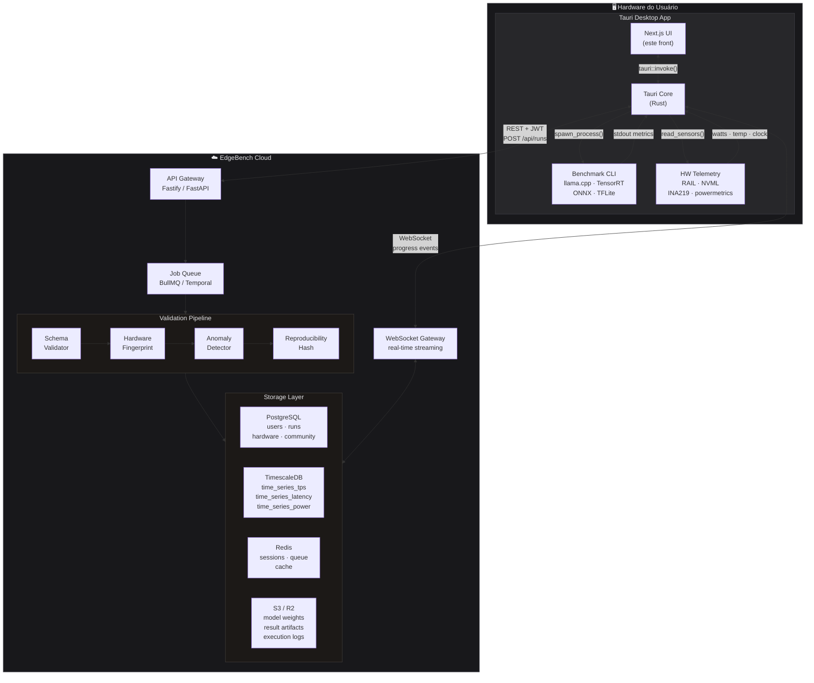
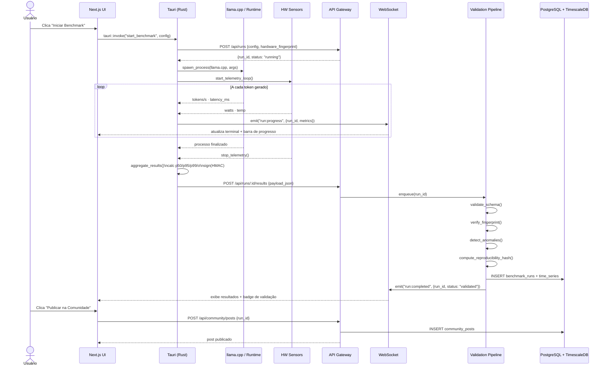
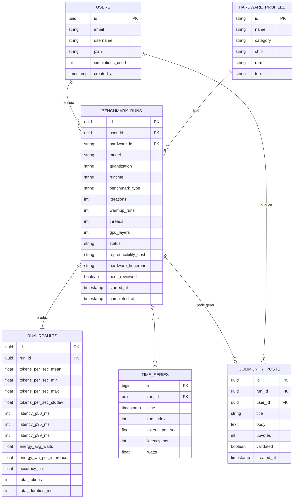
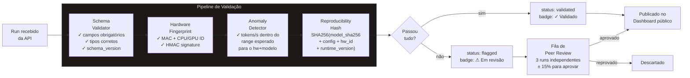
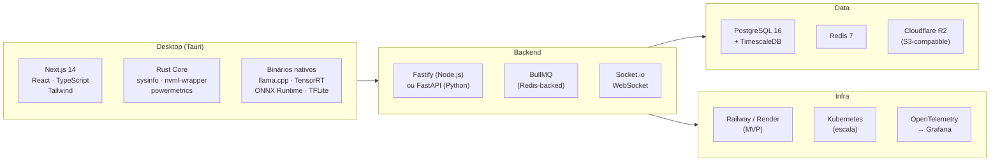

# EdgeBench — Arquitetura do Sistema

## Visão Geral

```mermaid
graph TB
    subgraph USER["🖥️  Hardware do Usuário"]
        direction TB
        subgraph TAURI["Tauri Desktop App"]
            direction LR
            UI["Next.js UI\n(este front)"]
            RUST["Tauri Core\n(Rust)"]
            CLI["Benchmark CLI\nllama.cpp · TensorRT\nONNX · TFLite"]
            HW["HW Telemetry\nRAIL · NVML\nINA219 · powermetrics"]

            UI <-->|"tauri::invoke()"| RUST
            RUST -->|"spawn_process()"| CLI
            RUST -->|"read_sensors()"| HW
            CLI -->|"stdout metrics"| RUST
            HW -->|"watts · temp · clock"| RUST
        end
    end

    subgraph CLOUD["☁️  EdgeBench Cloud"]
        direction TB
        GW["API Gateway\nFastify / FastAPI"]
        WS["WebSocket Gateway\nreal-time streaming"]
        QUEUE["Job Queue\nBullMQ / Temporal"]

        subgraph PIPELINE["Validation Pipeline"]
            direction LR
            SCH["Schema\nValidator"]
            FP["Hardware\nFingerprint"]
            ANOM["Anomaly\nDetector"]
            HASH["Reproducibility\nHash"]
            SCH --> FP --> ANOM --> HASH
        end

        subgraph STORAGE["Storage Layer"]
            direction LR
            PG["PostgreSQL\nusers · runs\nhardware · community"]
            TS["TimescaleDB\ntime_series_tps\ntime_series_latency\ntime_series_power"]
            RD["Redis\nsessions · queue\ncache"]
            S3["S3 / R2\nmodel weights\nresult artifacts\nexecution logs"]
        end

        GW --> QUEUE
        QUEUE --> PIPELINE
        PIPELINE --> STORAGE
        WS <--> STORAGE
    end

    RUST <-->|"REST + JWT\nPOST /api/runs"| GW
    RUST <-->|"WebSocket\nprogress events"| WS

    style USER fill:#18181b,stroke:#52525b,color:#e4e4e7
    style TAURI fill:#27272a,stroke:#3f3f46,color:#e4e4e7
    style CLOUD fill:#18181b,stroke:#52525b,color:#e4e4e7
    style PIPELINE fill:#1c1917,stroke:#44403c,color:#e4e4e7
    style STORAGE fill:#1c1917,stroke:#44403c,color:#e4e4e7
```

---

## Fluxo de Execução

```mermaid
sequenceDiagram
    actor U as Usuário
    participant UI as Next.js UI
    participant RUST as Tauri (Rust)
    participant CLI as llama.cpp / Runtime
    participant HW as HW Sensors
    participant API as API Gateway
    participant WS as WebSocket
    participant VAL as Validation Pipeline
    participant DB as PostgreSQL + TimescaleDB

    U->>UI: Clica "Iniciar Benchmark"
    UI->>RUST: tauri::invoke("start_benchmark", config)
    RUST->>API: POST /api/runs {config, hardware_fingerprint}
    API-->>RUST: {run_id, status: "running"}

    RUST->>CLI: spawn_process(llama.cpp, args)
    RUST->>HW: start_telemetry_loop()

    loop A cada token gerado
        CLI-->>RUST: tokens/s · latency_ms
        HW-->>RUST: watts · temp
        RUST->>WS: emit("run:progress", {run_id, metrics})
        WS-->>UI: atualiza terminal + barra de progresso
    end

    CLI-->>RUST: processo finalizado
    HW-->>RUST: stop_telemetry()
    RUST->>RUST: aggregate_results()\ncalc p50/p95/p99/σ\nsign(HMAC)

    RUST->>API: POST /api/runs/:id/results {payload_json}
    API->>VAL: enqueue(run_id)

    VAL->>VAL: validate_schema()
    VAL->>VAL: verify_fingerprint()
    VAL->>VAL: detect_anomalies()
    VAL->>VAL: compute_reproducibility_hash()

    VAL->>DB: INSERT benchmark_runs + time_series
    VAL->>WS: emit("run:completed", {run_id, status: "validated"})
    WS-->>UI: exibe resultados + badge de validação

    U->>UI: Clica "Publicar na Comunidade"
    UI->>API: POST /api/community/posts {run_id}
    API->>DB: INSERT community_posts
    API-->>UI: post publicado
```

---

## Modelo de Dados

```mermaid
erDiagram
    USERS {
        uuid id PK
        string email
        string username
        string plan
        int simulations_used
        timestamp created_at
    }

    HARDWARE_PROFILES {
        string id PK
        string name
        string category
        string chip
        string ram
        string tdp
    }

    BENCHMARK_RUNS {
        uuid id PK
        uuid user_id FK
        string hardware_id FK
        string model
        string quantization
        string runtime
        string benchmark_type
        int iterations
        int warmup_runs
        int threads
        int gpu_layers
        string status
        string reproducibility_hash
        string hardware_fingerprint
        boolean peer_reviewed
        timestamp started_at
        timestamp completed_at
    }

    RUN_RESULTS {
        uuid id PK
        uuid run_id FK
        float tokens_per_sec_mean
        float tokens_per_sec_min
        float tokens_per_sec_max
        float tokens_per_sec_stddev
        int latency_p50_ms
        int latency_p95_ms
        int latency_p99_ms
        float energy_avg_watts
        float energy_wh_per_inference
        float accuracy_pct
        int total_tokens
        int total_duration_ms
    }

    TIME_SERIES {
        bigint id PK
        uuid run_id FK
        timestamp time
        int run_index
        float tokens_per_sec
        int latency_ms
        float watts
    }

    COMMUNITY_POSTS {
        uuid id PK
        uuid run_id FK
        uuid user_id FK
        string title
        text body
        int upvotes
        boolean validated
        timestamp created_at
    }

    USERS ||--o{ BENCHMARK_RUNS : "executa"
    HARDWARE_PROFILES ||--o{ BENCHMARK_RUNS : "alvo"
    BENCHMARK_RUNS ||--|| RUN_RESULTS : "produz"
    BENCHMARK_RUNS ||--o{ TIME_SERIES : "gera"
    BENCHMARK_RUNS ||--o| COMMUNITY_POSTS : "pode gerar"
    USERS ||--o{ COMMUNITY_POSTS : "publica"
```

---

## Confiança nos Resultados (Anti-Fraude)

```mermaid
flowchart LR
    R["Run recebido\nda API"] --> S1

    subgraph VALIDATION["Pipeline de Validação"]
        S1["Schema\nValidator\n✓ campos obrigatórios\n✓ tipos corretos\n✓ schema_version"] -->
        S2["Hardware\nFingerprint\n✓ MAC + CPU/GPU ID\n✓ HMAC signature"] -->
        S3["Anomaly\nDetector\n✓ tokens/s dentro do\n  range esperado\n  para o hw+modelo"] -->
        S4["Reproducibility\nHash\nSHA256(model_sha256\n+ config + hw_id\n+ runtime_version)"]
    end

    S4 --> D{Passou\ntudo?}

    D -->|sim| V["status: validated\nbadge: ✓ Validado"]
    D -->|não| F["status: flagged\nbadge: ⚠ Em revisão"]

    V --> P["Publicado no\nDashboard público"]
    F --> PR["Fila de\nPeer Review\n3 runs independentes\n± 15% para aprovar"]
    PR -->|aprovado| P
    PR -->|reprovado| X["Descartado"]

    style VALIDATION fill:#1c1917,stroke:#44403c,color:#e4e4e7
```

---

## Stack Completa

```mermaid
graph LR
    subgraph DESKTOP["Desktop (Tauri)"]
        T1["Next.js 14\nReact · TypeScript\nTailwind"]
        T2["Rust Core\nsysinfo · nvml-wrapper\npowermetrics"]
        T3["Binários nativos\nllama.cpp · TensorRT\nONNX Runtime · TFLite"]
    end

    subgraph BACKEND["Backend"]
        B1["Fastify (Node.js)\nou FastAPI (Python)"]
        B2["BullMQ\n(Redis-backed)"]
        B3["Socket.io\nWebSocket"]
    end

    subgraph DATA["Data"]
        D1["PostgreSQL 16\n+ TimescaleDB"]
        D2["Redis 7"]
        D3["Cloudflare R2\n(S3-compatible)"]
    end

    subgraph INFRA["Infra"]
        I1["Railway / Render\n(MVP)"]
        I2["Kubernetes\n(escala)"]
        I3["OpenTelemetry\n→ Grafana"]
    end

    DESKTOP --> BACKEND
    BACKEND --> DATA
    BACKEND --> INFRA
```
